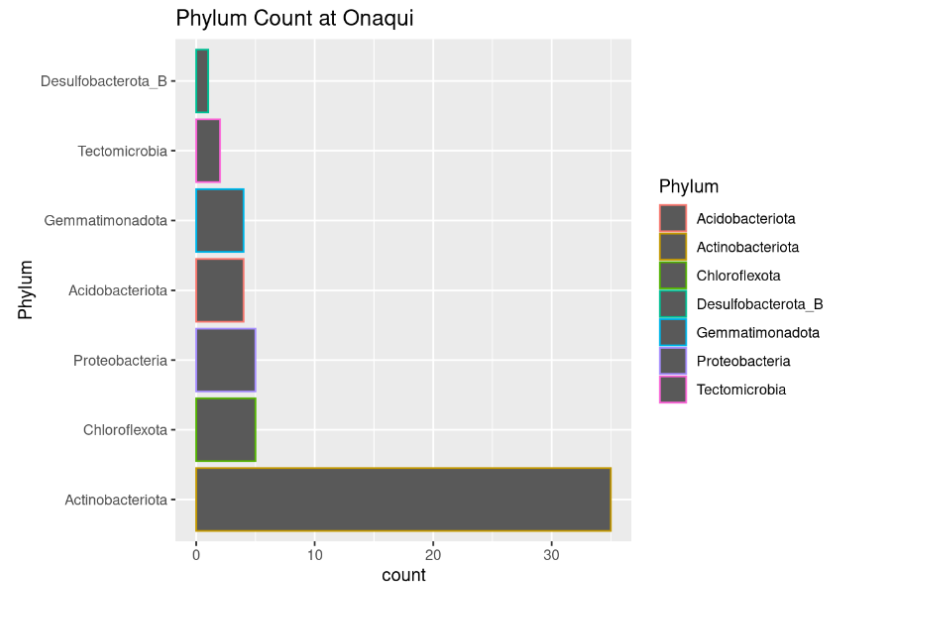
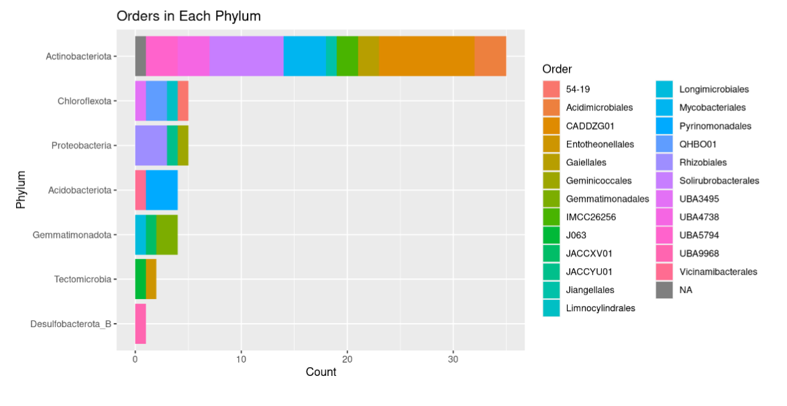
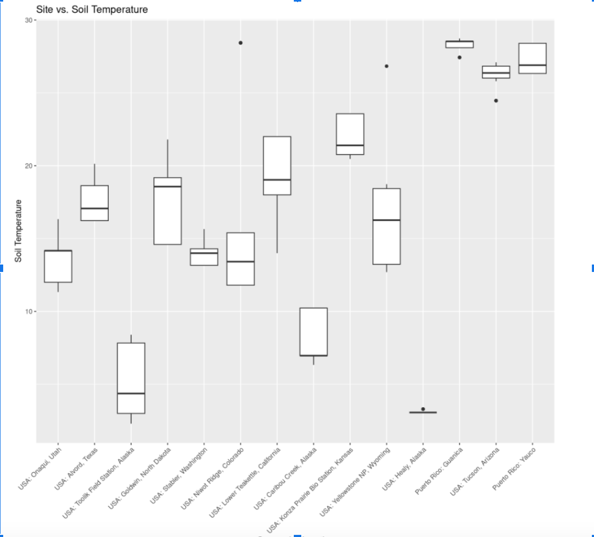
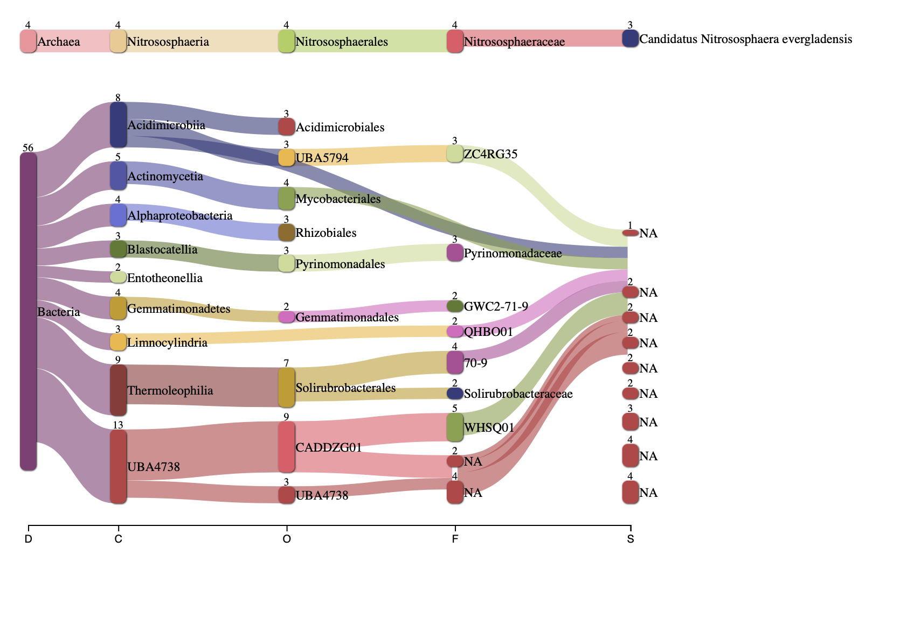
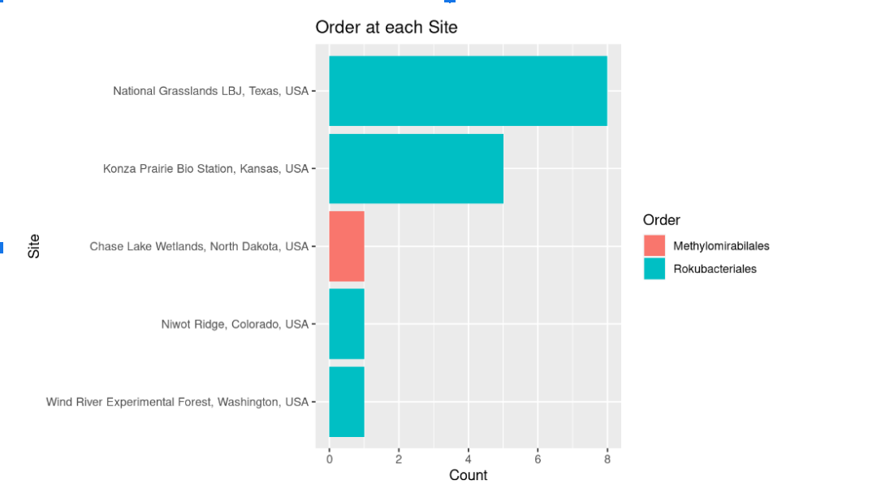
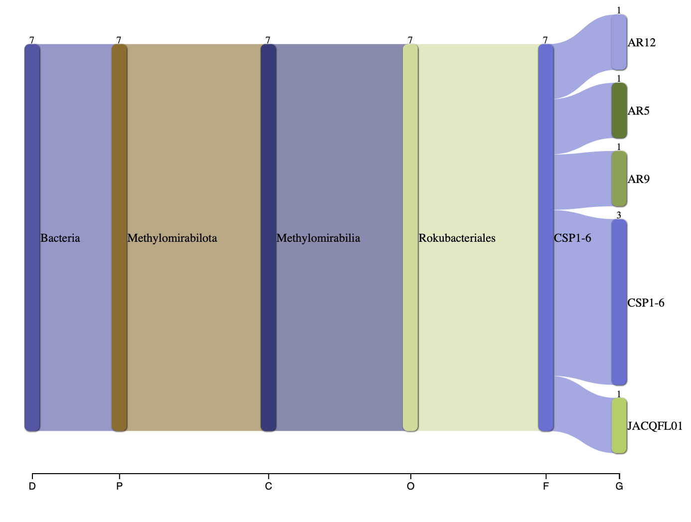
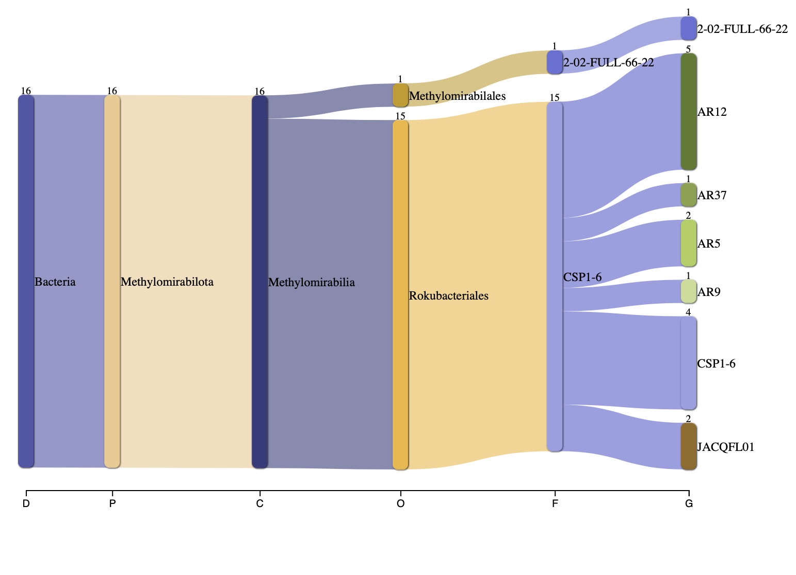
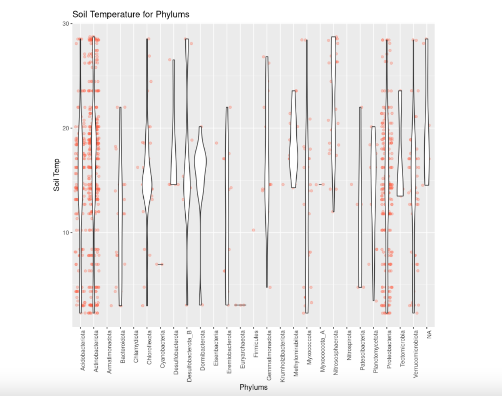

# Abstract

NEON provides data varying over a broad selection of ecosystems and phylum that are collected. We are going to analyze the methods in which the data from the site, Great Basin, Onaqui, Utah, USA is collected as well as data regarding the phylum, Methylomirabilota is collected. With reference to this data, various questions are asked in order to better understand these findings. The results will contain graphs, tables and phylogeny trees in order to visually comprehend the data collected by NEON. Using these data and visualizations, we will be able to analyze and comprehend the types of ecosystems in the USA, as well as how the different phylum in these ecosystems affect the sites.

# Motivating Reasons
NEON is an observational facility that’s purpose is to collect ecological data. With the data collected, they work with this information to appreciate and recognize the ecosystems in the United States. Additionally, they are able to look at this information over time to see how the ecosystems in America are changing, and perhaps what is changing them. NEON’s motivation is to eventually maintain the ecosystems in a sustainable environment using their partners and community. With the data NEON has collected, we have taken the information specifically regarding Great Basin, Onaqui, Utah, USA and Methylomirabilota. We are transforming their data into visualizations so that we can better understand their findings and display it in a more inclusive manner. We then can analyze the tables and graphs and make claims about the specific sites and phylum and how they relate to each other. 

# Introduction

NEON is a foundation also known as National Ecological Observatory Network. The purpose of NEON is to find ecological data based on different sites and taxonomic rankings to better understand the changes that are made over time. Specifically, we are looking at the terrestrial site of Great Basin, Onaqui, Utah, USA. At this specific site, we are going to take a look at which phylum, class and family of bacteria are located at this site, and how this affects the ecology of the location. Additionally, we are also going to look at the phylum, Methylomirabilota and analyze the presence of this phylum in different locations.

Onaqui is a terrestrial field site which is located about 50 miles southwest of Salt Lake City. The climate of this site is described to be warm with little precipitation, arid with hot summers and cold winters. There are a series of soils collected at this site which includes, taylorsflat, sterling, sevy, strevell and many more. The vegetation found at this site is located predominately on the eastern side of the site as well as the base of the mountains, and up the woodlands. The fauna found at this site includes coyotes, jackrabbits, rattlesnakes and other small mammals and birds. The current land management is under the control of the Bureau of Land Management. This allows for many different uses of the site including data collection, recreation as well as hunting.

Methylomirabilota is a bacteria which belongs to the phylum also known as NC10. This bacteria is known for its biogeochemical impact on different locations in which it is found. However, there is still much to be discovered about the methylomirabilota phylum. The main function of this bacteria is its ability to preform oxidation of methane as well as denitrification. This is done aerobically. The bacteria is found in a diverse selection of habitats, which is highlighted in the results section. The importance of methylomirabilota is that it contributes to the methane regulation and control in the ecosystem.

# Methods

NEON used multiple data collecting methods to receive the samples for each site as well as phylum. For each site the data was collected to report the weather, climate land cover and species within the ecosystem. The 3 methods that were used for data collection was Airborne Remote Sensing, Automated Instruments and observational sampling. The Airborne Remote sensing used spectrometers, digital cameras, lidar, GPS and Inertial Measurement unit in order to observe data. The automated instruments were used to collect soil, surface water and ground water to examine patterns as well as the bacteria found in these locations. Finally, observations were split into aquatic observations and terrestrial observations in which species diversity and environmental or chemical properties could be examined. The data was presented on the NEON website in which we were able to retrieve the data for our corresponding site and phylum. This specific data was then translated into a csv file so that it could successfully be imported into Rmarkdown. This is when the data could then be configured to represent different graphs and tables to present the data. This was done by asking site or phylum specific questions with respect to the data. The questions asked during this process is mentioned below.

## Questions

**Site Specific:**

-   Which MAG's are found within the subplots of Onaqui?

-   What is the taxonomic breakdown at Onaqui?

-   Are there any novel bacteria found in Onaqui?

-   What is the correlation of site/ecosystem subtype to soil temperature and soil pH?

**Phylum Specific:**

-   Where in the US are the phylum Methylomirabilota found?

-   Is Methylomirabilota found in our selected site?

-   Where is each order found?

-   What are the individual and co assemblies for Methylomirabilota?

-   What is the soil temperature for this phylum?

-   What are the ecosystem sub types for Methylomirabilota?

# Results

```{r}
library(tidyverse)
library(plotly) 
library(knitr) 
library(DT)
```

## Site Specific

**Question: Which MAG's are found within the subplots of Onaqui?**

```{r}
NEON_MAGs <- read_csv("data/NEON/GOLD_Study_ID_Gs0161344_NEON_edArchaea.csv") %>% 
  # remove columns that are not needed for data analysis
  select(-c(`GOLD Study ID`, `Bin Methods`, `Created By`, `Date Added`)) %>% 
  # create a new column with the Assembly Type
  mutate("Assembly Type" = case_when(`Genome Name` == "NEON combined assembly" ~ `Genome Name`,
                            TRUE ~ "Individual")) %>% 
  mutate_at("Assembly Type", str_replace, "NEON combined assembly", "Combined") %>% 
  separate(`GTDB-Tk Taxonomy Lineage`, c("Domain", "Phylum", "Class", "Order", "Family", "Genus"), "; ", remove = FALSE) %>% 
  # Get rid of the the common string "Soil microbial communities from "
  mutate_at("Genome Name", str_replace, "Terrestrial soil microbial communities from ", "") %>% 
  # Use the first `-` to split the column in two
  separate(`Genome Name`, c("Site","Sample Name"), " - ") %>% 
  # Get rid of the the common string "S-comp-1"
  mutate_at("Sample Name", str_replace, "-comp-1", "") %>%
  # separate the Sample Name into Site ID and plot info
  separate(`Sample Name`, c("Site ID","subplot.layer.date"), "_", remove = FALSE,) %>% 
  # separate the plot info into 3 columns
  separate(`subplot.layer.date`, c("Subplot", "Layer", "Date"), "-") 
```

```{r}
read_tsv("data/NEON/exported_img_data.tsv")
```

```{r}
if (!require("BiocManager", quietly = TRUE))
    install.packages("BiocManager")

BiocManager::install("treeio")
BiocManager::install("ggtreeExtra")
```

```{r}
library(tidyverse)
library(knitr)
library(ggtree)
library(TDbook) #A Companion Package for the Book "Data Integration, Manipulation and Visualization of Phylogenetic Trees" by Guangchuang Yu (2022, ISBN:9781032233574).
library(ggimage)
library(rphylopic)
library(treeio)
library(tidytree)
library(ape)
library(TreeTools)
library(phytools)
library(ggnewscale)
library(ggtreeExtra)
library(ggstar)
```

```{r}
NEON_MAGs <- read_csv("data/NEON/GOLD_Study_ID_Gs0161344_NEON_2024_4_21.csv") %>% 
  # remove columns that are not needed for data analysis
  select(-c(`GOLD Study ID`, `Bin Methods`, `Created By`, `Date Added`, `Bin Lineage`)) %>% 
  # create a new column with the Assembly Type
  mutate("Assembly Type" = case_when(`Genome Name` == "NEON combined assembly" ~ `Genome Name`,
                            TRUE ~ "Individual")) %>% 
  mutate_at("Assembly Type", str_replace, "NEON combined assembly", "Combined") %>% 
  mutate_at("GTDB-Tk Taxonomy Lineage", str_replace, "d__", "") %>%  
  mutate_at("GTDB-Tk Taxonomy Lineage", str_replace, "p__", "") %>% 
  mutate_at("GTDB-Tk Taxonomy Lineage", str_replace, "c__", "") %>% 
  mutate_at("GTDB-Tk Taxonomy Lineage", str_replace, "o__", "") %>% 
  mutate_at("GTDB-Tk Taxonomy Lineage", str_replace, "f__", "") %>% 
  mutate_at("GTDB-Tk Taxonomy Lineage", str_replace, "g__", "") %>% 
  mutate_at("GTDB-Tk Taxonomy Lineage", str_replace, "s__", "") %>%
  separate(`GTDB-Tk Taxonomy Lineage`, c("Domain", "Phylum", "Class", "Order", "Family", "Genus", "Species"), ";", remove = FALSE) %>% 
  mutate_at("Domain", na_if,"") %>% 
  mutate_at("Phylum", na_if,"") %>% 
  mutate_at("Class", na_if,"") %>% 
  mutate_at("Order", na_if,"") %>% 
  mutate_at("Family", na_if,"") %>% 
  mutate_at("Genus", na_if,"") %>% 
  mutate_at("Species", na_if,"") %>% 
  
  # Get rid of the the common string "Soil microbial communities from "
  mutate_at("Genome Name", str_replace, "Terrestrial soil microbial communities from ", "") %>% 
  # Use the first `-` to split the column in two
  separate(`Genome Name`, c("Site","Sample Name"), " - ") %>% 
  # Get rid of the the common string "S-comp-1"
  mutate_at("Sample Name", str_replace, "-comp-1", "") %>%
  # separate the Sample Name into Site ID and plot info
  separate(`Sample Name`, c("Site ID","subplot.layer.date"), "_", remove = FALSE,) %>% 
  # separate the plot info into 3 columns
  separate(`subplot.layer.date`, c("Subplot", "Layer", "Date"), "-")
```

```{r}
NEON_metagenomes <- read_tsv("data/NEON/exported_img_data_Gs0161344_NEON.tsv") %>% 
  select(-c(`Domain`, `Sequencing Status`, `Sequencing Center`)) %>% 
  rename(`Genome Name` = `Genome Name / Sample Name`) %>% 
  filter(str_detect(`Genome Name`, 're-annotation', negate = T)) %>% 
  filter(str_detect(`Genome Name`, 'WREF plot', negate = T)) 
```

```{r}
NEON_metagenomes <- NEON_metagenomes %>% 
  # Get rid of the the common string "Soil microbial communities from "
  mutate_at("Genome Name", str_replace, "Terrestrial soil microbial communities from ", "") %>% 
  # Use the first `-` to split the column in two
  separate(`Genome Name`, c("Site","Sample Name"), " - ") %>% 
  # Get rid of the the common string "-comp-1"
  mutate_at("Sample Name", str_replace, "-comp-1", "") %>%
  # separate the Sample Name into Site ID and plot info
  separate(`Sample Name`, c("Site ID","subplot.layer.date"), "_", remove = FALSE,) %>% 
  # separate the plot info into 3 columns
  separate(`subplot.layer.date`, c("Subplot", "Layer", "Date"), "-") 
```

```{r}
NEON_chemistry <- read_tsv("data/NEON/neon_plot_soilChem1_metadata.tsv") %>% 
  # remove -COMP from genomicsSampleID
  mutate_at("genomicsSampleID", str_replace, "-COMP", "")
```

```{r}
NEON_MAGs_metagenomes_chemistry <- NEON_MAGs %>% 
  left_join(NEON_metagenomes, by = "Sample Name") %>% 
  left_join(NEON_chemistry, by = c("Sample Name" = "genomicsSampleID")) %>% 
  rename("label" = "Bin ID")
```

```{r}
tree_arc <- read.tree("data/NEON/gtdbtk.ar53.decorated.tree")
tree_bac <- read.tree("data/NEON/gtdbtk.bac120.decorated.tree")
```

```{r}
# Make a vector with the internal node labels
node_vector_bac = c(tree_bac$tip.label,tree_bac$node.label)

# Search for your Phylum or Class to get the node
grep("Methylomirabilota", node_vector_bac, value = TRUE)
```

```{r}
match(grep("Methylomirabilota", node_vector_bac, value = TRUE), node_vector_bac)
```

```{r}
# Make a vector with the internal node labels
node_vector_arc = c(tree_arc$tip.label,tree_arc$node.label)

# Search for your Phylum or Class to get the node
grep("p__", node_vector_arc, value = TRUE)
```

```{r}
match(grep("p__", node_vector_arc, value = TRUE), node_vector_arc)
```

```{r}
# First need to preorder tree before extracting. N
tree_bac_preorder <- Preorder(tree_bac)
tree_Methylomirabilota <- Subtree(tree_bac_preorder, 1712)
```

```{r}
NEON_MAGs_Methylomirabilota <- NEON_MAGs_metagenomes_chemistry %>% 
  filter(Phylum == "Methylomirabilota")
```

```{r}
NEON_MAGs_metagenomes_chemistry_ONAQ <- NEON_MAGs_metagenomes_chemistry %>% 
  filter(`Site ID.x` == "ONAQ")
```

```{r}
NEON_MAGs_metagenomes_chemistry_ONAQ <- NEON_MAGs_metagenomes_chemistry %>% 
  filter(`Site ID.x` == "ONAQ") %>% 
  filter(Domain == "Bacteria")
```

```{r}
ONAQ_MAGs_label <- NEON_MAGs_metagenomes_chemistry_ONAQ$label
```

```{r}
tree_bac_ONAQ_MAGs <-drop.tip(tree_bac,tree_bac$tip.label[-match(ONAQ_MAGs_label, tree_bac$tip.label)])
```

```{r}
ggtree(tree_bac_ONAQ_MAGs, layout="circular")  %<+%
  NEON_MAGs_metagenomes_chemistry +
  geom_point(mapping=aes(color=Phylum))
```

*This is a phylogeny tree of the phylums present in the location Onaqui. These are the MAG's specific to this site, however, just shown in a different visualization. In the image, it shows that the majority of the phylum are very close to each other on the tree, which means they are very closely related.*

```{r}
NEON_MAGs_bact_ind <- NEON_MAGs %>% 
  filter(Domain == "Bacteria") %>% 
  filter(`Assembly Type` == "Individual") 
```

```{r}
NEON_utah <- NEON_MAGs_bact_ind %>%
  filter(Site== "Great Basin, Onaqui, Utah, USA")
```

```{r}
NEON_utah %>% 
ggplot(aes(x = fct_rev(fct_infreq(Phylum)), fill = Subplot)) +
  geom_bar() +
  coord_flip()
labs(title = "MAG Count for each Subplot")
```

*This graph is showing the subplot for the site, Onaqui, Great Basin, Utah, USA. Additionally, it is showing the MAG count of each type of bacteria that is present in that subplot. Actinobacteriota is found in the most subplots, and found most frequently in subplot 004.*

**Question: What is the taxonomic breakdown at Onaqui?**

```{r}
NEON_MAGs_bact_ind %>% 
ggplot(aes(x = fct_rev(fct_infreq(Phylum)), fill = Site)) +
  geom_bar(position = "dodge") +
  coord_flip()
```


*The graph above is showing the count of each site according to each phylum. The colors represent how much of the count is in each location. When looking at Methylomirabilota, there is a very small count of this phylum in the USA. The majority of this is in Texas, USA. The site Onaqui has the majority of it's count in Actinobacteriota.*

```{r, fig.width = 10, fig.height= 16}
NEON_MAGs_bact_ind %>% 
ggplot(aes(x = Phylum)) +
  geom_bar(position = position_dodge2(width = 0.9, preserve = "single")) +
  coord_flip() +
  facet_wrap(vars(Site), scales = "free", ncol = 2)
```


*This image gives a closer look at each site that was demonstrated in the graph before. This shows that specifically in our site, Onaqui, there is a drastic change in the count between Actinobacteriota and the rest of the phylum at that site.*



*This image is showing the phylum count that is found at this specific location. This shows that Actinobacteria has the highest count at this location and Desulfobacteriota_B has the lowest count. The phylum Methylomirabilota is not found.*



*This image shows the count of each order in each phylum found at Onaqui. Actinobacteriota has the largest variety of order within its count, with the largest amount being from the Entotheonellales order.*

```{r}
NEON_utah %>% 
  ggplot(aes(x = fct_rev(fct_infreq(Order)), fill = `Family`)) + geom_bar() + coord_flip() + 
  labs(title = "Family in each order", y = "Count", x = "Order")
```

*This graph is showing the Family in each order as a break down of what is present at Onaqui. It is shown that the families WHSQ01, 70-9, soilrubrobacteraceae have the highest overall counts specifically in the orders of CADDZG01 and soilrubrobacterales.*

**Question: Are there any novel bacteria found in Onaqui?**

```{r}
NEON_MAGs_bact_ind %>% 
  filter(is.na(Class) | is.na(Order) | is.na(Genus) | is.na(Family) | is.na(Phylum) | is.na(Domain))%>%
ggplot(aes(x = fct_infreq(Site))) +
  geom_bar() +
  coord_flip()
```

*This graph is showing the count of novel bacteria found at each site. The site we have selected for, Great, Basin, Onaqui, Utah, USA has a count of \~28 novel bacteria.*

**Question: What is the correlation of site/ecosystem subtype to soil temperature and soil pH?**



*This graph is showing the soil temperature for each site. The far left box plot is showing our site with has a range of soil temperature from 11-16°.*

```{r}
NEON_MAGs <- read_csv("data/NEON/GOLD_Study_ID_Gs0161344_NEON_edArchaea.csv") %>% 
  # remove columns that are not needed for data analysis
  select(-c(`GOLD Study ID`, `Bin Methods`, `Created By`, `Date Added`)) %>% 
  # create a new column with the Assembly Type
  mutate("Assembly Type" = case_when(`Genome Name` == "NEON combined assembly" ~ `Genome Name`,
                            TRUE ~ "Individual")) %>% 
  mutate_at("Assembly Type", str_replace, "NEON combined assembly", "Combined") %>% 
  separate(`GTDB-Tk Taxonomy Lineage`, c("Domain", "Phylum", "Class", "Order", "Family", "Genus"), "; ", remove = FALSE) %>% 
  # Get rid of the the common string "Soil microbial communities from "
  mutate_at("Genome Name", str_replace, "Terrestrial soil microbial communities from ", "") %>% 
  # Use the first `-` to split the column in two
  separate(`Genome Name`, c("Site","Sample Name"), " - ") %>% 
  # Get rid of the the common string "S-comp-1"
  mutate_at("Sample Name", str_replace, "-comp-1", "") %>%
  # separate the Sample Name into Site ID and plot info
  separate(`Sample Name`, c("Site ID","subplot.layer.date"), "_", remove = FALSE,) %>% 
  # separate the plot info into 3 columns
  separate(`subplot.layer.date`, c("Subplot", "Layer", "Date"), "-")
```

```{r}
NEON_metagenomes <- read_tsv("data/NEON/exported_img_data_Gs0161344_NEON.tsv") %>% 
  rename(`Genome Name` = `Genome Name / Sample Name`) %>% 
  filter(str_detect(`Genome Name`, 're-annotation', negate = T)) %>% 
  filter(str_detect(`Genome Name`, 'WREF plot', negate = T))
```
```{r}
NEON_metagenomes <- NEON_metagenomes %>% 
  # Get rid of the the common string "Soil microbial communities from "
  mutate_at("Genome Name", str_replace, "Terrestrial soil microbial communities from ", "") %>% 
  # Use the first `-` to split the column in two
  separate(`Genome Name`, c("Site","Sample Name"), " - ") %>% 
  # Get rid of the the common string "-comp-1"
  mutate_at("Sample Name", str_replace, "-comp-1", "") %>%
  # separate the Sample Name into Site ID and plot info
  separate(`Sample Name`, c("Site ID","subplot.layer.date"), "_", remove = FALSE,) %>% 
  # separate the plot info into 3 columns
  separate(`subplot.layer.date`, c("Subplot", "Layer", "Date"), "-") 
```

```{r}
NEON_chemistry <- read_tsv("data/NEON/neon_plot_soilChem1_metadata.tsv") %>% 
  # remove -COMP from genomicsSampleID
  mutate_at("genomicsSampleID", str_replace, "-COMP", "")
```

```{r}
kable(
  NEON_chemistry_description <- read_tsv("data/NEON/neon_soilChem1_metadata_descriptions.tsv") 
)
```

```{r}
NEON_MAGs_column <- NEON_MAGs %>%
  select("Sample Name","Site ID","GTDB-Tk Taxonomy Lineage" )
```
```{r}
NEON_metagenomes_column <- NEON_metagenomes %>%
  select("Sample Name","Site ID","Ecosystem Subtype")
```
```{r}
NEON_chemistry_column <- NEON_chemistry %>%
  select("genomicsSampleID","siteID","nlcdClass")
```
```{r}
NEON_MAGS_site <- NEON_metagenomes_column %>%
 filter(`Site ID` == "ONAQ")
```
```{r}
NEON_metagenomes_site <- NEON_metagenomes_column %>%
  filter(`Site ID` == "ONAQ")
```
```{r}
NEON_chemistry_site <- NEON_chemistry_column %>%
  filter('Site ID' == "ONAQ")
```
```{r}
NEON_MAGS_site %>% 
  left_join(NEON_metagenomes_site, by = "Sample Name")
```
```{r}
NEON_metagenomes_site %>% 
  left_join(NEON_chemistry_site, by = c("Sample Name" = "genomicsSampleID"))
```
```{r}
NEON_metagenomes_site %>% 
  left_join(NEON_chemistry_site, by = c("Sample Name" = "genomicsSampleID"))
```
```{r}
 NEON_metagenomes_site %>% 
  left_join(NEON_chemistry_site, by = c("Site ID" = "siteID"))
```
```{r}
Table_7 <- NEON_metagenomes %>%
  full_join(NEON_MAGs, by = "Sample Name")
```
```{r}
Table_8 <- Table_7 %>%
  full_join(NEON_chemistry, by = c("Sample Name" = "genomicsSampleID"))
```
```{r}
Table_9 <- Table_8 %>%
  filter(str_detect(`GTDB-Tk Taxonomy Lineage`, "Methylomirabilota"))
```

```{r}
Table_9 %>%
  ggplot(aes(x = fct_infreq(`Ecosystem Subtype`), y = soilTemp, color = Order)) + 
  geom_point() +
  coord_flip()
```

*This graph is demonstrating The ecosystem sub types with which order is present at that ecosystem as well as what the soil temperature is. At the bottom, the grasslanbs have various counts of the Rokubacteriales at different soil temperatures.*
```{r}
Table_9 %>%
  ggplot(aes(x = fct_infreq(`nlcdClass`), y = soilInCaClpH, color = Family)) + 
  geom_point() +
  coord_flip()
```

*This graph is showing the ecosystem sub types as well as what the soil pH is for the families at that location. The CSP1-6 family has various locations of ecosystems and a variety of soil pH. However,n the 2-02-FULL-66-22 family is only located in the emergent herbaceous wetlands with a soil pH of ~7.*

**Question: What are all the taxa at Onaqui?**

 

*This graph is showing all of the taxa that is present at this site.*

### Discussion of Results 
The specific site that is observed is the terrestrial site Great Basin, Onaqui, Utah, USA. With the data collected through NEON, we were able to determine the taxonomic breakdown of this location as well as the soil temperature and pH at this location. The taxonomic breakdown includes the phylum count, and the orders in each phylum, family count, MAG count by class. The data shows that the most abundant phylum present at Onaqui is the Actinobacteriota phylum. This phylum also shows to have various counts of different orders within this phylum, reaching a total count of 35. The subplot graph is displaying the count of which orders are present in each subplot of the site. Subplot 004 has the highest MAG count of ~30, as well as the presence of almost all 14 classes present at the entire site of ONAQ. The graph indicating the  family count at Onaqui shows that the highest count of 5 at this site is WHSQ-01, with 70-9 as the next highest count with 4. From the NEON data we were also able to visualize the soil temperature and pH at this site. The soil temperature at Onaqui is within a range of ~12-16°. The median temperature of the soil at this location is closest to the 3rd quartile which is right below 15°. The soil temperature at Onaqui has overlapping temperatures with many other sites studied through NEON. The pH of the soil at this site is illustrated in the graph which shows which family is present at that soil pH. The family CSP1-6 is found at soil pH at a range from 5-7. The family 2-02-FULL-66-22 is only present at the soil pH of ~7. 

## Phylum Specific

**Question: Where in the US are the phylum of Methylomirabilota found? Is Methylomirabilota found in our selected site?**

```{r}
NEON_MAGS_table <- NEON_MAGs_bact_ind %>%
  filter(Phylum=='Methylomirabilota')
datatable(
  NEON_MAGS_table %>%
  count(Site, sort = TRUE))
```

*This table is showing the 5 locations in which Methylomirabilota is found, as well as the count. This is showing that the highest amount of our phylum found is in National Grasslands LBJ, Texas, USA. Additionally, the Methylomirabilota is not found in our selected site, Utah.*

```{r}
NEON_MAGS_table %>% 
  ggplot(aes(x = fct_rev(fct_infreq(Site)), fill = `Genus`)) + geom_bar() +
  coord_flip() +
  labs(title = "Genus at each site", y= "Count", x = "Site")
```

*This graph is showing the genus that is present at each site. The genus is a smaller group of the taxonomic ranking. It shows which genus from the Methylomirabilota phylum is located in which location. The site with the most genus' is Texas, USA. Additionally, the genus AR12 is most abundant here.*

**Question: Where is each order found?**



*This is showing the specific order from the phylum Methylomirabilota at each site found. It shows that 4 of the sites have presence of Rokubacteriales while 1 site has the order of Methylomirabirales present.*

**Question: What are the individual and co assemblies for Methylomirabilota?**



*This is the co-assembly of Methylomirabilota at our site.*



*This is the individual assembly of Methylomirabilota at our site.*

```{r}
if (!require("BiocManager", quietly = TRUE))
    install.packages("BiocManager")

BiocManager::install("treeio")
BiocManager::install("ggtreeExtra")
```

```{r}
library(tidyverse)
library(knitr)
library(ggtree)
library(TDbook) #A Companion Package for the Book "Data Integration, Manipulation and Visualization of Phylogenetic Trees" by Guangchuang Yu (2022, ISBN:9781032233574).
library(ggimage)
library(rphylopic)
library(treeio)
library(tidytree)
library(ape)
library(TreeTools)
library(phytools)
library(ggnewscale)
library(ggtreeExtra)
library(ggstar)
```

```{r}
NEON_MAGs <- read_csv("data/NEON/GOLD_Study_ID_Gs0161344_NEON_2024_4_21.csv") %>% 
  # remove columns that are not needed for data analysis
  select(-c(`GOLD Study ID`, `Bin Methods`, `Created By`, `Date Added`, `Bin Lineage`)) %>% 
  # create a new column with the Assembly Type
  mutate("Assembly Type" = case_when(`Genome Name` == "NEON combined assembly" ~ `Genome Name`,
                            TRUE ~ "Individual")) %>% 
  mutate_at("Assembly Type", str_replace, "NEON combined assembly", "Combined") %>% 
  mutate_at("GTDB-Tk Taxonomy Lineage", str_replace, "d__", "") %>%  
  mutate_at("GTDB-Tk Taxonomy Lineage", str_replace, "p__", "") %>% 
  mutate_at("GTDB-Tk Taxonomy Lineage", str_replace, "c__", "") %>% 
  mutate_at("GTDB-Tk Taxonomy Lineage", str_replace, "o__", "") %>% 
  mutate_at("GTDB-Tk Taxonomy Lineage", str_replace, "f__", "") %>% 
  mutate_at("GTDB-Tk Taxonomy Lineage", str_replace, "g__", "") %>% 
  mutate_at("GTDB-Tk Taxonomy Lineage", str_replace, "s__", "") %>%
  separate(`GTDB-Tk Taxonomy Lineage`, c("Domain", "Phylum", "Class", "Order", "Family", "Genus", "Species"), ";", remove = FALSE) %>% 
  mutate_at("Domain", na_if,"") %>% 
  mutate_at("Phylum", na_if,"") %>% 
  mutate_at("Class", na_if,"") %>% 
  mutate_at("Order", na_if,"") %>% 
  mutate_at("Family", na_if,"") %>% 
  mutate_at("Genus", na_if,"") %>% 
  mutate_at("Species", na_if,"") %>% 
  
  # Get rid of the the common string "Soil microbial communities from "
  mutate_at("Genome Name", str_replace, "Terrestrial soil microbial communities from ", "") %>% 
  # Use the first `-` to split the column in two
  separate(`Genome Name`, c("Site","Sample Name"), " - ") %>% 
  # Get rid of the the common string "S-comp-1"
  mutate_at("Sample Name", str_replace, "-comp-1", "") %>%
  # separate the Sample Name into Site ID and plot info
  separate(`Sample Name`, c("Site ID","subplot.layer.date"), "_", remove = FALSE,) %>% 
  # separate the plot info into 3 columns
  separate(`subplot.layer.date`, c("Subplot", "Layer", "Date"), "-")
```

```{r}
NEON_metagenomes <- read_tsv("data/NEON/exported_img_data_Gs0161344_NEON.tsv") %>% 
  select(-c(`Domain`, `Sequencing Status`, `Sequencing Center`)) %>% 
  rename(`Genome Name` = `Genome Name / Sample Name`) %>% 
  filter(str_detect(`Genome Name`, 're-annotation', negate = T)) %>% 
  filter(str_detect(`Genome Name`, 'WREF plot', negate = T)) 
```

```{r}
NEON_metagenomes <- NEON_metagenomes %>% 
  # Get rid of the the common string "Soil microbial communities from "
  mutate_at("Genome Name", str_replace, "Terrestrial soil microbial communities from ", "") %>% 
  # Use the first `-` to split the column in two
  separate(`Genome Name`, c("Site","Sample Name"), " - ") %>% 
  # Get rid of the the common string "-comp-1"
  mutate_at("Sample Name", str_replace, "-comp-1", "") %>%
  # separate the Sample Name into Site ID and plot info
  separate(`Sample Name`, c("Site ID","subplot.layer.date"), "_", remove = FALSE,) %>% 
  # separate the plot info into 3 columns
  separate(`subplot.layer.date`, c("Subplot", "Layer", "Date"), "-") 
```

```{r}
NEON_chemistry <- read_tsv("data/NEON/neon_plot_soilChem1_metadata.tsv") %>% 
  # remove -COMP from genomicsSampleID
  mutate_at("genomicsSampleID", str_replace, "-COMP", "")
```

```{r}
NEON_MAGs_metagenomes_chemistry <- NEON_MAGs %>% 
  left_join(NEON_metagenomes, by = "Sample Name") %>% 
  left_join(NEON_chemistry, by = c("Sample Name" = "genomicsSampleID")) %>% 
  rename("label" = "Bin ID")
```

```{r}
tree_arc <- read.tree("data/NEON/gtdbtk.ar53.decorated.tree")
tree_bac <- read.tree("data/NEON/gtdbtk.bac120.decorated.tree")
```

```{r}
# Make a vector with the internal node labels
node_vector_bac = c(tree_bac$tip.label,tree_bac$node.label)

# Search for your Phylum or Class to get the node
grep("Methylomirabilota", node_vector_bac, value = TRUE)
```

```{r}
match(grep("Methylomirabilota", node_vector_bac, value = TRUE), node_vector_bac)
```

```{r}
# Make a vector with the internal node labels
node_vector_arc = c(tree_arc$tip.label,tree_arc$node.label)

# Search for your Phylum or Class to get the node
grep("p__", node_vector_arc, value = TRUE)
```

```{r}
match(grep("p__", node_vector_arc, value = TRUE), node_vector_arc)
```

```{r}
# First need to preorder tree before extracting. N
tree_bac_preorder <- Preorder(tree_bac)
tree_Methylomirabilota <- Subtree(tree_bac_preorder, 1712)
```

```{r}
NEON_MAGs_Methylomirabilota <- NEON_MAGs_metagenomes_chemistry %>% 
  filter(Phylum == "Methylomirabilota")
```

```{r}
ggtree(tree_Methylomirabilota, layout="circular")  %<+%
  NEON_MAGs_metagenomes_chemistry + 
  geom_tiplab(size=2, hjust=-.1) +
  xlim(0,20) +
  geom_point(mapping=aes(color=Class, shape = `Assembly Type`))
```

*This phylogeny tree is showing the classes within the phylum Methylomirabilota as well as whether or not they are co-assembled or individually assembled. This is another way to look at the data that was also provided in the sankey plots.*
```{r}
NEON_MAGs_metagenomes_chemistry_noblank <- NEON_MAGs_metagenomes_chemistry %>% 
  rename("AssemblyType" = "Assembly Type") %>% 
  rename("BinCompleteness" = "Bin Completeness") %>% 
  rename("BinContamination" = "Bin Contamination") %>% 
  rename("TotalNumberofBases" = "Total Number of Bases") %>% 
  rename("EcosystemSubtype" = "Ecosystem Subtype")
```

```{r}
ggtree(tree_Methylomirabilota, layout="circular", branch.length="none") %<+% 
  NEON_MAGs_metagenomes_chemistry + 
  geom_point2(mapping=aes(color=`Ecosystem Subtype`, size=`Total Number of Bases`)) + 
  new_scale_fill() + 
  geom_fruit(
      data=NEON_MAGs_metagenomes_chemistry_noblank,
      geom=geom_tile,
      mapping=aes(y=label, x=1, fill= AssemblyType),
      offset=0.08,   # The distance between external layers, default is 0.03 times of x range of tree.
      pwidth=0.25 # width of the external layer, default is 0.2 times of x range of tree.
      ) + 
  new_scale_fill() +
  geom_fruit(
          data=NEON_MAGs_metagenomes_chemistry_noblank,
          geom=geom_col,
          mapping=aes(y=label, x=TotalNumberofBases),  
          pwidth=0.4,
          axis.params=list(
                          axis="x", # add axis text of the layer.
                          text.angle=-45, # the text size of axis.
                          hjust=0  # adjust the horizontal position of text of axis.
                      ),
          grid.params=list() # add the grid line of the external bar plot.
      ) + 
      theme(#legend.position=c(0.96, 0.5), # the position of legend.
          legend.background=element_rect(fill=NA), # the background of legend.
          legend.title=element_text(size=7), # the title size of legend.
          legend.text=element_text(size=6), # the text size of legend.
          legend.spacing.y = unit(0.02, "cm")  # the distance of legends (y orientation).
      )
```

*This table is an extended phylogeny tree of the one from before. This includes the ecosystem sub type, individual and co-assemblys as well as the total number of bases.*


**Question: What are the soil temperature for this phylum?**



*This shows the soil temperature that each phylum is found at. Methylomirabilota has a smaller range of temperatures compared to other phylum. This range is from \~14-24°.*

**Question: What are the ecosystem sub types for Methylomirabilota?**

```{r}
NEON_MAGs_metagenomes_chemistry_noblank <- NEON_MAGs_metagenomes_chemistry %>% 
  rename("AssemblyType" = "Assembly Type") %>% 
  rename("BinCompleteness" = "Bin Completeness") %>% 
  rename("BinContamination" = "Bin Contamination") %>% 
  rename("TotalNumberofBases" = "Total Number of Bases") %>% 
  rename("EcosystemSubtype" = "Ecosystem Subtype")

ggtree(tree_Methylomirabilota)  %<+%
  NEON_MAGs_metagenomes_chemistry + 
  geom_tippoint(aes(colour=`Ecosystem Subtype`)) + 

# For unknown reasons the following does not like blank spaces in the names
  geom_facet(panel = "Bin Completeness", data = NEON_MAGs_metagenomes_chemistry_noblank, geom = geom_point, 
      mapping=aes(x = BinCompleteness)) +
  geom_facet(panel = "Bin Contamination", data = NEON_MAGs_metagenomes_chemistry_noblank, geom = geom_col, 
                aes(x = BinContamination), orientation = 'y', width = .6) +
  theme_tree2(legend.position=c(.1, .7))
```

*This image has a combination of 3 tables. The far left is showing the ecosystem sub types in which Methylomirabilota is found in. The colors are coordinated to type of ecosystem they are found in. The other two graphs are showing the bin completeness and contamination. This is including the amount of gene markers that are shared between them.*

### Discussion of Results 
As mentioned before, Methylomirabilis, or NC10, is a bacterial phylum. Within the NEON database, there are 23 collections of bacteria that belong to the Methylomirabilis phylum. Out of the 23 collections, 16 collections were collected by the Individual Assembly while 7 collections were from the NEON combined assembly. This lab will mostly focus on the 16 collections from the Individual Assembly.

As it can be seen within the Individual Assembly collections above, all 16 out of the 16 collections belong to the Class Methylomirabilia. However, when going deeper down into the taxonomy, 15 out of the 16 collections belong to the Order Rokubacteriales while 1 collection belongs to the Order Methylmirabilales. 

Outside of the taxonomic breakdown, it can be seen that the Methylomirabilis Phylum was collected at 5 different NEON sites, with a majority of the collections at the National Grasslands LBJ and Konza Prairie BioStation sites. Within that, there are 6 genus that are also found within those sites. The two orders, methylomirabilis and rokubacterias were also found at those sites. However, Rokubacteriales was found at 4 locations while Methylmirablilales was only found at one. The soil temperature that this phylum was found to be at was 14-24°.  This range is much smaller than all the other ranges of temperature for the other phylum. 


# Discussion
The results that were obtained from the NEON data set as well as the visuals from above were used to make conclusions about the site and phylum we highlighted. We found that when looking at the individual assemblies for our phylum at the site, there is no evidence of it being found. However, the co-assembly shows evidence in which there is little presence of the phylum, Methylomirabilota. We were able to gather more information as to which phylum are prominent features to the ecosystem in Onaqui. These include Actinobacteria, Chloroflexota and Proteobacteria. Additionally, we were able to break down even further as to which orders and families were found. It was found that the average soil temperature at this site is much lower than the average soil temperature in which Methylomirabilota is found in. This could be one of the factors as to why it is not found there. By understanding Methylomirabilota, what it's characteristics and functions are, and what environments it is found in, we can better understand its importance to the ecosystem most abundant in. Additionally, by gathering data from the site, we can analyze how the phylum of bacteria found within Onaqui impact the ecosystem in which it is today. 


# Conclusion
We thank NEON for creating useful, clear and important data in which we can further analyze. The importance of understanding these phylum and sites, specifically Onaqui and Methylomirabilota, is to better grasp the ecosystems in the USA. Working with the data collected from NEON, we were able to produce graphs and tables which visually display the data. With this, we were able to make conclusions as to what is present, and perhaps even why that it. There is much more data that is available within NEON that can allow us to further understand the different ecosystems in the US. In the future, with our data and findings, we can continue to learn more about how our ecosystems are changing and how we can adapt to them and protect them so they continue to be healthy and stable. 

# References 
[@Novel]
[@NEON]
[@DOE]
[@Metagenome]
[@Utah]
[@Shrub]
